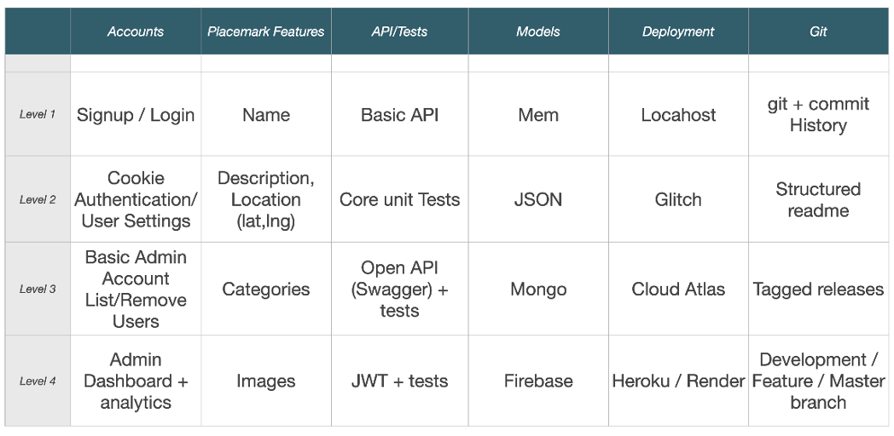

# Placemark-1.0

## Holiday Planner

**Placemark-1.0** is a Node.js and Hapi application designed to streamline holiday planning. It provides users with a comprehensive platform to efficiently plan their vacations, including accommodation, dining, and activities.

### Features

- **Categorical Sections**: Organize your holiday plans into distinct categories, including accommodation, food, and activities.
- **Efficient Planning**: Easily add, edit, and remove items within each category to tailor your holiday itinerary to your preferences.
- **User-Friendly Interface**: Intuitive and user-friendly interface for seamless navigation and interaction.
- **Customization**: Customize your holiday plans according to your specific preferences and requirements.
- **Responsive Design**: Responsive layout ensures optimal viewing and usability across various devices and screen sizes.

### Versions:

1. Version 1 (level 1): This version hold the most basic design.
2. Version 2 (level 2): hold all of level 2 features including suggested search, lat, lng from API call, Glitch: .

### Installation

To install Placemark-1.0, follow these steps:

1. Clone the repository: `git clone https://github.com/your-username/placemark-1.0.git`
2. Navigate to the project directory: `cd placemark-1.0`
3. Install dependencies: `npm install`

### Usage

1. Start the application: `npm start`
2. Open your web browser and navigate to `http://localhost:3000`
3. Begin planning your holiday by exploring the different categorical sections and adding your desired items.

### Contributing

We welcome contributions from the community to improve Placemark-1.0. If you'd like to contribute, please follow these steps:

1. Fork the repository.
2. Create a new branch for your feature or bug fix: `git checkout -b feature-branch`
3. Make your changes and commit them: `git commit -am 'Add new feature'`
4. Push to the branch: `git push origin feature-branch`
5. Submit a pull request.

### License

Placemark-1.0 is licensed under the [MIT License](LICENSE).

---

This README provides an overview of Placemark-1.0, its features, installation instructions, usage guidelines, contribution guidelines, and licensing information. Feel free to explore the repository and start planning your next holiday with ease!

Refrences: 
(suggestion search bar)
https://www.algolia.com/blog/engineering/how-to-implement-autocomplete-with-javascript-on-your-website/
# placemark-v1.1-typescript
